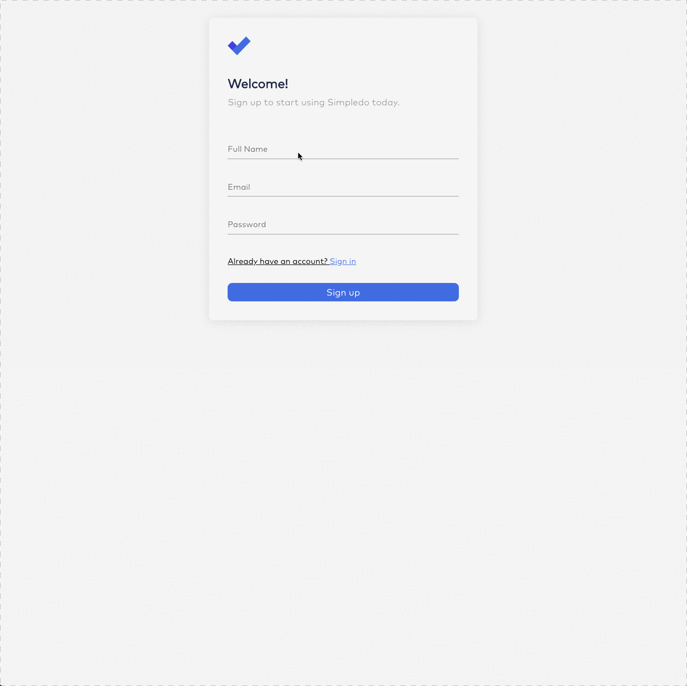
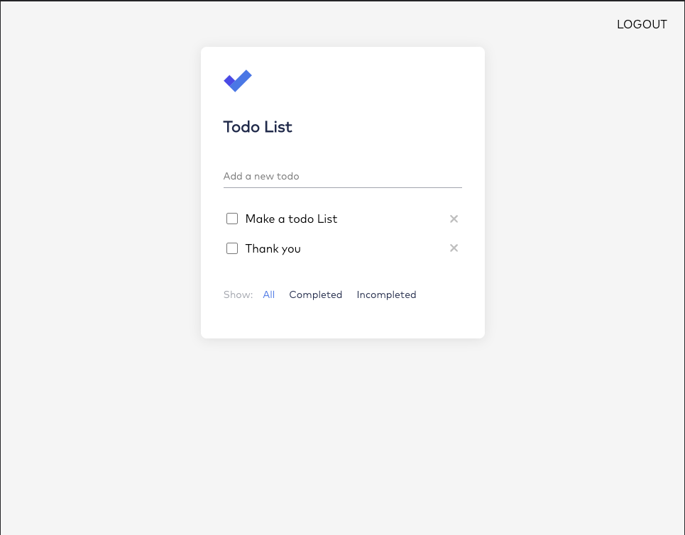
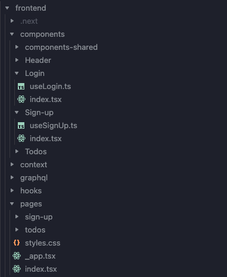

# Todo App FoodStyles Technical Challenge

## 📝 Description

[](#description)

Implement a basic Todo app having an API and a web interface.



### The API

Implement a Node server for managing todos.

#### Specifications

- ✅ Implement a GraphQL or REST API
- ✅ Use a relational database (e.g. Postgres, MySQL, SQLite, etc.) as data storage, and an ORM of your choice (e.g. Objection, Sequelize, etc.) to implement your migrations and queries. (PostgreSQL and Prisma)

#### Endpoints

Implement these endpoints as GraphQL queries/mutations or REST:

- ✅ createTodo(title)
- ✅ markTodoCompleted(id)
- ✅ markTodoUncompleted(id)
- ✅ deleteTodo(id)
- ✅ listTodos

#### Bonus

Implement endpoints for:

- ✅ signUp(name, email, password)
- ✅ login(email, password)
- ✅ make it possible only for authenticated users to manage todos.



## 💾 Installation

[](#installation)

- ### :whale: Install Docker

  [Install Docker Locally](https://docs.docker.com/get-docker/)

- ### :wrench: First install run migrations

  To First configure the database you just need to launch docker

  ```bash
    npm run docker:start
  ```

  The command will launch the postgres docker instance

  And once the docker instance is ready, you must run the migration command

  ```bash
    npm run prisma:init
  ```

  When the migration is finished successfully you can stock the docker image.

- ### :rocket: Launch the app

  When the migration is ready you can launch the app running the following command in the root directory:

  ```bash
   npm run start
  ```

## 📐 Architecture Decisions

[](#aproach)

- ### Project Structure

  First think you are gonna notice is that this project is structured as a monorepo using [NX](https://nx.dev/).
  There is not a real technical reason to use this technology. Although monorepos could be a great architecture decision
  in complex projects, in this case and the be honest I use it because I wanted to test it and I thought this challenge
  could be a great opportunity to learn more about the library.

- ### Server

  I've decided to use [Express](https://expressjs.com/) framework for the API of the application. Over express I'm using
  a graphql framework called [GraphQL Yoga](https://the-guild.dev/graphql/yoga-server).

  This framework provides a simple interface to handle GraphQL queries and configuration.
  As ORM framework I've decided to use [Prisma](https://www.prisma.io/), It's a very well known framework and great to use in
  with typescript.

  To handle authentication we use a very simple JWT encryption.

- ### Client

  The client is a [Nextjs](https://nextjs.org/) based application.

  The structure of the application is a very common folder scaffolding, having a `components` folder for the presentational components and a `pages` folder where there are the different pages.

  

  The state of the application, as is a very simple one, it's held in a `SessionContext` component.
  This decision for the state is not maybe the best one in a real world example, but it's the best excuse to show a very detailed pattern to handle the state and it makes me very careful with the re-renders of the components, so I can show my understanding of the react internal renderings using React.`React.memo` and `useCallback` in the cases where it's necessary.

  I'm using also a [useEncapsulation](https://kyleshevlin.com/use-encapsulation) pattern in every component it has some logic. It's a pattern that I liked and allows me to have a separation between logic and UI, and in case, it's very useful for testing.

  To handle fetching data from the server we use [Apollo Client](https://www.apollographql.com/docs/react), which is
  the most common frontend library to handle graphQL queries and mutations.

- ### Styles

  I decided to use Emotion with CSS-IN-JS, I think I could show a better knowledge using the last CSS features. All the CSS depends hugely on custom properties which could allow to change the complete style of the application easily or even creathe different themes.

## 🔜 Future Implementations

[](#cud)

- I would like to add more testing. Add E2E tests with cypress would be cool but unfortunately I didn't have enough time.
- I would like to handle all the authentication logic in a backend session. Saving the jwt in a session cookie so the token would`t be exposed and we could use the SSR feature of next.
- It would be great to add a component to show toast messages giving feedback to the user about different actions and errors.
- In a real world app, I would had added a CI pipeline integration. The use of Nx would help a lot with that because it already brings some commands to handle the correct steps as run only affected tests, lint, etc...


</details>
